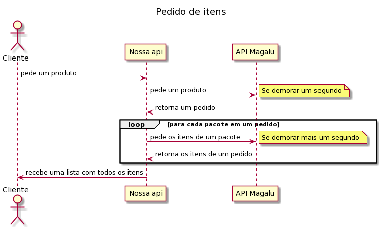

# 🐆 Processos assíncronos

## O problema

Vamos pensar um pouquinho na funcionalidade "Dado um pedido, retornar os seus itens" que já implementamos.

Nosso algoritmo faz uma primeira requisição para recuperar os pacotes de um pedido, para em seguida fazer uma nova requisição para cada um dos pacotes e recuperar os seus itens.

A primeira vista isto parece _ok_, mas aqui temos alguns problemas escondidos aí.

Enquanto estamos trabalhando em uma requisição, todas as outras estão aguardando. O `uvicorn` que é o servidor que estamos utilizando até pode ter vários trabalhadores (`workers`) para mitigar um pouco isto, porém caso várias requisições aconteçam ao mesmo tempo, os trabalhadores podem ficar ocupados.

Enquanto o servidor remoto não me responde, preciso ficar aguardando e depois da sua resposta eu refaço este ciclo para cada um dos pacotes.

Isto pode demorar um longo tempo.

Vamos ver um desenho de como isto acontece:



Se a primeira requisição demorar 1 segundo e as demais também, se um pedido tiver 10 pacotes demoraremos 11s para responder todos os itens.

😨 Nossa, isto não está parecendo muito legal...os valores de 1 segundo para cada requisição pode ser um pouco exagerado, mas ajuda a evidenciar o problema.

## Demonstração e Solução

Vamos fazer uma simulação utilizando código para visualisar melhor este cenário.

Crie um arquivo de exemplo como visto abaixo e execute-o para ver na prática o que estamos falando.

Para executa-lo utilize: `poetry run python exemplo.py`

> exemplo.py
```python
httpx.get("https://httpbin.org/delay/1")  # simula a requisição de um pedido
print("pedido recuperado")
for pacote in range(10):  # simula o a iteração sobre os pacotes
    # simula a requisição para buscar os itens de um pacote
    httpx.get("https://httpbin.org/delay/1")
    print(f"Os itens do pacote {pacote} foram recuperados.")
```
E como podemos fazer para melhorar?!?!

Seria legal se pudessemos fazer várias requisições ao mesmo tempo, isto podia poupar um tempo.
Não ficariamos ociosos enquanto aguardamos a api do Magalu responder.

E na verdade podemos! Podemos pedir os itens dos pacotes ao mesmo tempo e  aguardar enquanto eles chegam.

> exemplo_async.py
```python
import asyncio
import httpx


async def recupera_itens(id_pacote, cliente):
    # simula a requisição para buscar os itens de um pacote
    await cliente.get("https://httpbin.org/delay/1")
    print(f"Os itens do pacote {id_pacote} foram recuperados.")


async def main():
    async with httpx.AsyncClient() as cliente:
        await cliente.get("https://httpbin.org/delay/1")  # simula a requisição de um pedido
        print("pedido recuperado")
        await asyncio.gather(
            *(recupera_itens(id_pacote, cliente) for id_pacote in range(10))
        )

asyncio.run(main())
```

O código se torna um pouco mais complexo, porém temos um ganho considerável se compararmos as duas soluções.

A primeira mudança é adição de um cliente assíncrono e mudança de nossa função para uma função assíncrona, com isso podemos fazer a requisição de um pedido e enquanto espera, trabalhar em outra coisa. Depois transformamos a chamada de recuperação de itens em assíncronas também, assim todas podem ser feitas ao mesmo tempo e aguardaremos seus retornos com a função `gather`. O papel dessa função é literalmente agrupar todas as respostas.

Um detalhe que precisamos ficar atento aqui é que toda função assíncrona é aguardado com a expressão `await` e que await sempre estará presente em uma função assíncrona.

A unica função que não esperamos utilizando `await` é a função `main`, que é passadapara a função `run`, que por baixo dos panos cria um loop de eventos necessário para executar funções assíncronas e aguarda a execução da mesma.

> ⚡ Ficou interessado em ler mais sobre chamadas assíncronas em Python?? A documentação do [Python](https://docs.python.org/pt-br/3/library/asyncio.html) ou do [FastAPI](https://fastapi.tiangolo.com/pt/async/) podem te ajudar.

## Modificando nossa API

Para nossa sorte os frameworks escolhidos (httpx e fastapi) já são compatíveis com chamadas assíncronas, e não precisaremos de grandes modificações no código.

Mesmo assim, ao invés de modificar nossas funções feitas até agora, vamos criar uma nova `recuperar_itens_por_pedido` porém dessa vez assíncrona. Criaremos um novo arquivo com nome `magalu_api_async` com o conteúdo apresentado abaixo.

O código será bem similar ao que já vimos no exemplo acima.

> api_produtos/magalu_api_async.py
```python
import asyncio
import os
from http import HTTPStatus
from itertools import chain
from uuid import UUID

import httpx

from api_pedidos.esquema import Item
from api_pedidos.excecao import (
    FalhaDeComunicacaoError,
    PedidoNaoEncontradoError,
)

# tenant e apikey fixos somente para demonstrações
APIKEY = os.environ.get("APIKEY", "coloque aqui sua apikey")
TENANT_ID = os.environ.get("TENANT_ID", "21fea73c-e244-497a-8540-be0d3c583596")
MAGALU_API_URL = "https://alpha.api.magalu.com"
MAESTRO_SERVICE_URL = f"{MAGALU_API_URL}/maestro/v1"


async def _recupera_itens_por_pacote(cliente, uuid_do_pedido, uuid_do_pacote):
    response = await cliente.get(
        f"{MAESTRO_SERVICE_URL}"
        f"/orders/{uuid_do_pedido}/packages/{uuid_do_pacote}/items",
        headers={"X-Api-Key": APIKEY, "X-Tenant-Id": TENANT_ID},
    )
    response.raise_for_status()
    return [
        Item(
            sku=item["product"]["code"],
            description=item["product"].get("description", ""),
            image_url=item["product"].get("image_url", ""),
            reference=item["product"].get("reference", ""),
            quantity=item["quantity"],
        )
        for item in response.json()
    ]


async def recuperar_itens_por_pedido(
    identificacao_do_pedido: UUID,
) -> list[Item]:
    async with httpx.AsyncClient() as cliente:
        try:
            response = await cliente.get(
                f"{MAESTRO_SERVICE_URL}/orders/{identificacao_do_pedido}",
                headers={"X-Api-Key": APIKEY, "X-Tenant-Id": TENANT_ID},
            )
            response.raise_for_status()
            pacotes = response.json()["packages"]
            itens = await asyncio.gather(
                *(
                    _recupera_itens_por_pacote(
                        cliente, identificacao_do_pedido, pacote["uuid"]
                    )
                    for pacote in pacotes
                )
            )
            # truque para unir as listas em uma única lista
            return list(chain.from_iterable(itens))
        except httpx.HTTPStatusError as exc:
            if exc.response.status_code == HTTPStatus.NOT_FOUND:
                raise PedidoNaoEncontradoError() from exc
        except httpx.HTTPError as exc:
            # aqui poderiam ser tratados outros erros como autenticação
            raise FalhaDeComunicacaoError() from exc
```

As mudanças foram explicadas no exemplo anterior, mas repare que como cada requisição retorna uma lista dos itens, precisamos agrupa-los em uma única lista. É como se tivessemos uma lista de listas `[[1, 2, 3], [4, 5, 6]]` e vamos transformar em `[1, 2, 3 ,4, 5, 6]`.

E o código da _api_, o que precisamos modificar?

Pode parecer estranho mas não precisamos mudar muita coisa.

> api_produtos/api.py
```python
# ...
from api_pedidos.magalu_api_async import recuperar_itens_por_pedido
# ...
@app.exception_handler(PedidoNaoEncontradoError)
async def tratar_erro_pedido_nao_encontrado(
    request: Request, exc: PedidoNaoEncontradoError
):
# ...
@app.exception_handler(FalhaDeComunicacaoError)
async def tratar_erro_falha_de_comunicacao(
    request: Request, exc: FalhaDeComunicacaoError
):
# ...
@app.get(
    "/healthcheck",
    tags=["healthcheck"],
    summary="Integridade do sistema",
    description="Checa se o servidor está online",
    response_model=HealthCheckResponse,
)
async def healthcheck():
# ...
@app.get(
    "/orders/{identificacao_do_pedido}/items",
    responses={
        HTTPStatus.NOT_FOUND.value: {
            "description": "Pedido não encontrado",
            "model": ErrorResponse,
        },
        HTTPStatus.BAD_GATEWAY.value: {
            "description": "Falha de comunicação com o servidor remoto",
            "model": ErrorResponse,
        },
    },
    summary="Itens de um pedido",
    tags=["pedidos"],
    description="Retorna todos os itens de um determinado pedido",
    response_model=list[Item],
)
async def listar_itens(itens: list[Item] = Depends(recuperar_itens_por_pedido)):
# ...
```

A adição de `sync` torna os nosso endpoints assíncronos embora caso eles ainda executem códigos síncronos podemos ter o bloqueio dos nossos trabalhadores.

Uma coisa engraçada é que como nossos testes são baseados em requisições não precisamos altera-los. O comportamento da _api_ deve ser o mesmo. Vamos rodar os testes para garantir que tudo está ok.

## 🔧 Testando manualmente

A nossa aplicação pode estar ainda rodando, mas caso não esteja vamos inicia-la.

O comando para isto é `uvicorn --reload api_pedidos.api:app`.

Vamos testar alguns cenários?

O que acontece se passar um valor qualquer ao invés de um uuid válido?

`http :8000/orders/invalido/items`

E um pedido que não existe?

`http :8000/orders/e3ae3598-8034-4374-8eed-bdca8c31d5a0/items`

Por fim vamos ver um pedido que existe.

`http :8000/orders/efb77dcf-d83c-4935-81ac-7be5f37e6cdc/items`

Você pode testar a falha do servidor remoto modificando a url no arquivo `api_pedidos/magalu_api.py`.

## 💾 Salvando a versão atual do código

Com tudo terminado, vamos salvar a versão atual do código.

Primeiro passo é checar o que foi feito até agora:

```bash
$ git status
On branch main
Your branch is up to date with 'origin/main'.

Changes not staged for commit:
  (use "git add <file>..." to update what will be committed)
  (use "git restore <file>..." to discard changes in working directory)
        modified:   api_pedidos/api.py

Untracked files:
  (use "git add <file>..." to include in what will be committed)
        api_pedidos/magalu_api_async.py
        exemplo.py
        exemplo_async.py

no changes added to commit (use "git add" and/or "git commit -a")
```

Vamos adicionar ao versionamento os arquivos novos e avisar modificações em alguns já existentes.

`git add api_pedidos exemplo.py exemplo_async.py`

💾 Agora vamos consolidar uma nova versão.

`git commit -m "Modifica api para responder de forma assíncrona"`

:octocat: Por fim envie ao github a versão atualizada do projeto.

`git push`

Nossa caixa de ferramentas acabou de ganhar uma ferramenta nova e pode ser bastante útil em outros momentos.

Vamos seguir para a pŕoxima técnica? Estou ansioso e você?! 🤓

> 🐂 Uma api robusta deve-se preocupar com o seu tempo de resposta.

[Circuit breaker ➡️](breaker.md)

[⬅️ Desafios](desafios.md)

[↩️ Voltar ao README ](README.md)