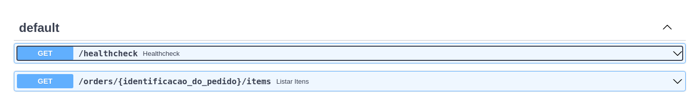
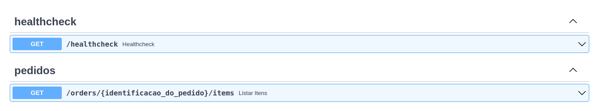
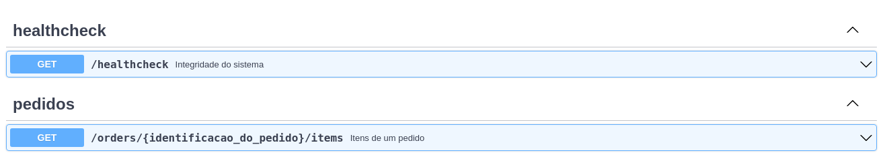
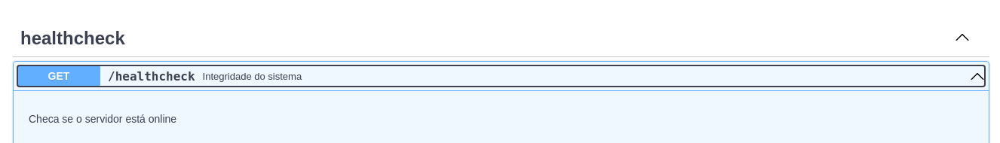
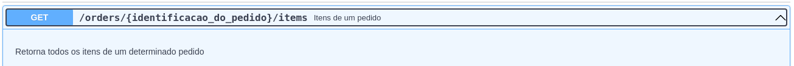
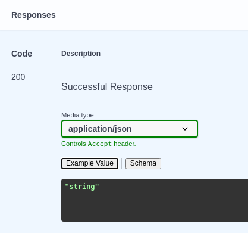
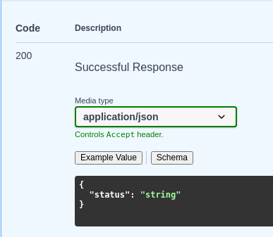
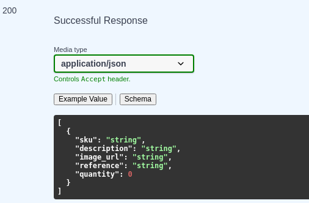
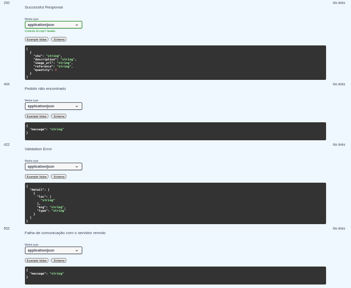

# 📜 Documentação

## 📖 Por que documentar?

Temos nossa API funcionando, mas ainda não temos nenhuma documentação.

Como esperar a integração de terceiros em nosso sistema?

Seria tão bom se pudesse transformar todo esse código produzido até agora com as definições de valores de entrada e saída em um documento de forma que fosse mais fácil de entender.

Por sorte o FastAPI já tem um [`Swagger`](https://fastapi.tiangolo.com/tutorial/swagger-ui/) que pode ser usado para gerar uma documentação.

Mas onde está essa documentação? Preciso dar algum comando especial?

Até agora vinhamos testando nossa aplicação manualmente utilizando a ferramenta `httpie`, mas que tal se tivessemos uma interface mais amigável para testar nossa aplicação?

Se a sua aplicação não estiver no ar, suba-a através do comando:

```
uvicorn --reload api_pedidos.api:app
```

Agora acesse a URL `http://localhost:8000/docs` e veja a documentação.

Alem desta interface, temos também a geração automática de uma documentação seguindo as especificações da [OpenAPI 3.0](https://swagger.io/specification/). Você pode acessa-la através do endereço `http://localhost:8000/docs/openapi.json`.

Isto nos trás dois benefícios, agora possuimos uma documentação interativa seguindo um padrão consolidado no mercado, e também possuimos uma documentação que pode ser usada para gerar automaticamente um cliente da API em diversas linguagens.

> ℹ️ Consulte https://swagger.io/tools/swagger-codegen/ para saber mais sobre o processo de geração de clientes à partir de uma documentação.

## 📔 Aprimorando nossa documentação

Navegando por nossa api percebemos ambos os endpoints estão agrupados em conjunto chamado _default_.

Podemos melhorar isto agrupando os endpoints de recursos similares utilizando _tags_.

Hoje nossa documentação está assim:



Modificando ambos os endpoints para serem agrupados por tags, ficamos assim:

> api_pedidos/api.py
```python
# ...
@app.get("/healthcheck", tags=["healthcheck"])
# ...
@app.get("/orders/{identificacao_do_pedido}/items", tags=["pedidos"])
# ...
```



Uma outra melhoria que podemos fazer em nossa documentação  é aprimorar a exibição de cada um dos endpoints (hoje a descrição curta é apenas o nome da função que utilizamos).

Essa alteração será feita no arquivo `api_pedidos/api.py`:

> api_pedidos/api.py
```python
# ...
@app.get("/healthcheck", tags=["healthcheck"], summary="Integridade do sistema")
# ...
@app.get("/orders/{identificacao_do_pedido}/items", tags=["pedidos"], summary="Itens de um pedido")
# ...
```



Vamos adicionar também uma descrição mais detalhada para cada _endpoint_.

```python
# ...
@app.get("/healthcheck", tags=["healthcheck"], summary="Integridade do sistema", description="Checa se o servidor está online")
# ...
@app.get("/orders/{identificacao_do_pedido}/items", summary="Itens de um pedido", tags=["pedidos"], description="Retorna todos os itens de um determinado pedido")
# ...
```




Uma outra melhoria seria tornar explícito o retorno dos _endpoints_ desenvolvidos até agora.

Começando pelo _healthcheck_:

Antes da melhoria, a documentação era assim:




> api_pedidos/esquema.py
```python
# ...
class HealthCheckSchema(BaseModel):
    status: str
```

> api_pedidos/api.py
```python
from api_pedidos.esquema import HealthCheckResponse, Item
# ...
@app.get("/healthcheck", tags=["healthcheck"], summary="Integridade do sistema", description="Checa se o servidor está online", response_model=HealthCheckResponse)
def healthcheck():
    return HealthCheckResponse(status="ok")
# ...
```

Após a melhoria, a documentação fica assim:



Vamos fazer ajuste similar para o _endpoint_ de _pedidos_:

Antes da melhoria, a documentação era assim:


> api_pedidos/api.py
```python
# ...
@app.get("/orders/{identificacao_do_pedido}/items", summary="Itens de um pedido", tags=["pedidos"], description="Retorna todos os itens de um determinado pedido", response_model=list[Item])
# ... 
```

> ⚠️ Se estiver utilizando Python na em versões anteriores a 3.9, deve-se utilizar o tipo `List[Item]` para o retorno do endpoint.

Depois da melhoria, a documentação fica assim:



Durante a implementação nós definimos alguns cenários possíveis como o pedido não existir, ou não conseguir se comunicar com a API externa. Mas estes retornos não estão sinalizados na nossa documentação.

Vamos adicioná-los?!

Primeira coisa, talvez seja interessante padronizarmos os retornos de erro da nossa api em um esquema.

> api_pedidos/esquema.py
```python
# ...
class ErrorResponse(BaseModel):
    message: str
```

Depois disso vamos adicionar o esquema de retorno de erro na documentação:

```python
# ...
@app.get("/orders/{identificacao_do_pedido}/items", responses={
    HTTPStatus.NOT_FOUND.value: {
        "description": "Pedido não encontrado",
        "model": ErrorResponse,
    },
    HTTPStatus.BAD_GATEWAY.value: {
        "description": "Falha de comunicação com o servidor remoto",
        "model": ErrorResponse,
    }}, summary="Itens de um pedido", tags=["pedidos"], description="Retorna todos os itens de um determinado pedido", response_model=list[Item])
# ...
```



> 💁 Ainda temos outras customizações na documentação que podem ser interessantes como exemplos de entradas e saídas. Para mais exemplos consulte: https://fastapi.tiangolo.com/advanced/additional-responses/

🥳 Agora nossa api está documentada! Ficou muito mais fácil para alguém que queira se integrar a sua API. **Mas não se esqueça de manter sempre atualizada a documentação!**

## 💾 Salvando a versão atual do código

Com tudo terminado, vamos salvar a versão atual do código.

Primeiro passo é checar o que foi feito até agora:

```bash
$ git status
On branch main
Your branch is up to date with 'origin/main'.

Changes not staged for commit:
  (use "git add <file>..." to update what will be committed)
  (use "git restore <file>..." to discard changes in working directory)
	modified:   api_pedidos/api.py
	modified:   api_pedidos/esquema.py

no changes added to commit (use "git add" and/or "git commit -a")
```

Vamos adicionar as mudanças nesta revisão.

`git add api_pedidos/api.py api_pedidos/esquema.py`


💾 Agora vamos consolidar uma nova versão.

`git commit -m "Adiciona documentação ao projeto"`

:octocat: Por fim envie ao github a versão atualizada do projeto.

`git push`

Agora que temos uma api e documentação, vamos dar um próximo passo na qualidade e evolução do nosso projeto.

Cumprimos mais um requisito:

- [x] Como será consumido por terceiros deve apresentar boa documentação;

> 🐂 Uma api robusta possui boa documentação facilitando assim uma integração externa.

[Integração contínua ➡️](continua.md)

[⬅️ Integração com serviços externos](externos.md)

[↩️ Voltar ao README ](README.md)