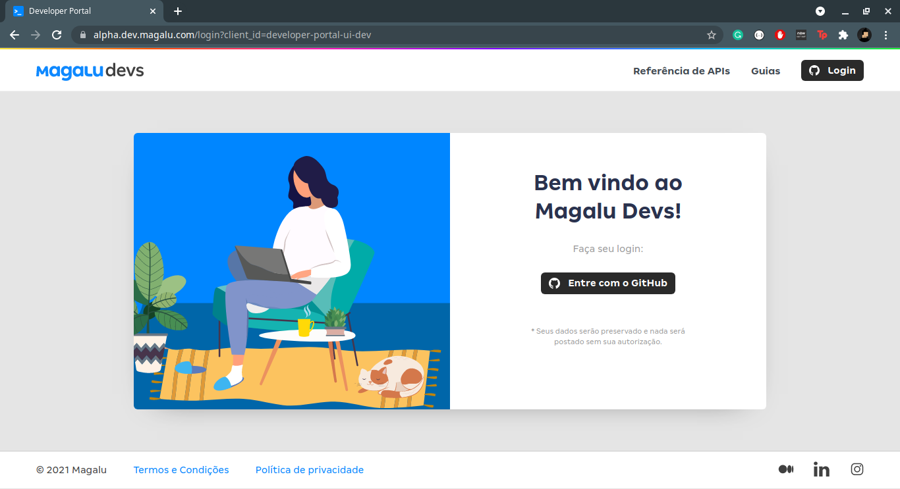

# 🗺️ Explorando a API do Magalu

A API do Marketplace da Magalu oferece acesso programático a uma variedade de funcionalidades, expostas como endpoints [REST](https://becode.com.br/o-que-e-api-rest-e-restful/), acessíveis via HTTPS. Com esta API você pode:

* Escrever aplicações que utilizam todos os recursos da API, agindo em nome de um usuário final, como por exemplo, um parceiro Magalu vendendo produtos no marketplace;

* Consultar seus pedidos de venda, aceitá-los e realizar os passos essenciais para sua operação, incluindo faturamento e envio;

* Atender e responder a chamados abertos sobre suas vendas e os produtos vendidos.

> ⚠️ Como as APIs abertas do Magalu se encontram em alpha, uma autorização pévia é necessária. Por isso, você pode utilizar uma versão simulada da mesma.
> As instruções de instalação e execução se encontram no readme do [projeto](./apis-simuladas).
> Lembre-se de trocar "https://alpha.dev.magalu.com/" por "http://localhost:8080"
> A APIKEY utilizada no acesso simulado é "5734143a-595d-405d-9c97-6c198537108f".
>  Não deixe de explorar a API como demonstrado acima, mesmo que seja sua versão simulada.

Acesse a página para desenvolvedores: https://alpha.dev.magalu.com/



> ⚠️ O portal do desenvolvedor ainda está em alpha e seu uso é restrito. Durante o tutorial vamos liberar o acesso ao portal para que você possa testar a API.

Após estar autorizado, vamos precisar de uma chave para acessar a API. Podemos obter o valor desta chave clicando em [painel](https://alpha.dev.magalu.com/dashboard).

Com a chave de acesso (APIKEY) em mãos, vamos explorar alguns endpoints.

> Lugares onde encontrar `<APIKEY>`, substitua pelo valor que você obteve no painel.

Primeiro vamos verificar se sua conta está ativa. Utilize o seguinte comando:

```
http https://alpha.api.magalu.com/account/v1/whoami X-API-KEY:<APIKEY>
```

A API apresenta um conceito chamado de _tenant_ que representa qual a visão do dado que você está acessando. Uma mesma conta pode possuir várias visualizações, como por exemplo, uma para consumidor e outra para vendas de produtos.

Aqui focaremos somente na visão de um vendedor (seller) e utilizaremos o _tenant_ `stenagam` que é uma visão de dados fictícios utilizados para testes.

> Para mais detalhes sobre tenants e perspectivas acesse [Tenants e Perspectivas](https://alpha.dev.magalu.com/guias/walkthrough#tenants-e-perspectivas)

```
http https://alpha.api.magalu.com/account/v1/whoami/tenants X-API-KEY:<APIKEY>
```

Copie a identificação (uuid) do tenant `stenagam.SELLER` para ser utilizado nas próximas requisições.

Próximo passo é explorar a consulta de pedidos e seus itens.

```
http https://alpha.api.magalu.com/maestro/v1/orders X-API-KEY:<APIKEY> X-TENANT-ID:21fea73c-e244-497a-8540-be0d3c583596
```

Podemos verificar também um pedido em específico.

```
http https://alpha.api.magalu.com/maestro/v1/orders/13bdb3e3-8fad-4f9b-a6c3-2fa99786289f X-API-KEY:<APIKEY> X-TENANT-ID:21fea73c-e244-497a-8540-be0d3c583596
```

Assim como podemos consultar uma lista de produtos a partir de um pedido e seu respectivo pacote.

```
http  https://alpha.api.magalu.com/maestro/v1/orders/efb77dcf-d83c-4935-81ac-7be5f37e6cdc/packages/e3ae3598-8034-4374-8eed-bdca8c31d5a0 X-API-KEY:<APIKEY> X-TENANT-ID:21fea73c-e244-497a-8540-be0d3c583596
```

ou ainda mais específico:

```
http  https://alpha.api.magalu.com/maestro/v1/orders/efb77dcf-d83c-4935-81ac-7be5f37e6cdc/packages/e3ae3598-8034-4374-8eed-bdca8c31d5a0/items X-API-KEY:<APIKEY> X-TENANT-ID:21fea73c-e244-497a-8540-be0d3c583596
```

Dado estes endpoints, parece que precisamos fazer uma primeira consulta para obter os pacotes de um pedido e em seguida realizar a requisição para obter os itens de um pedido.

> Para mais detalhes sobre a api consulte [API Maestro](https://alpha.dev.magalu.com/apis/maestro)

[↩️ Voltar](externos.md#)
