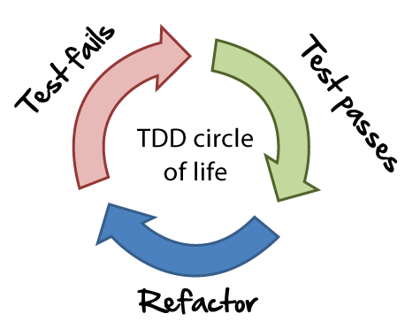

# 🐐 Desenvolvimento guiado por testes (TDD)

<p align="center">
  
</p>

## Testes automatizados

Talvez tenha chegado aqui sem conhecimento sobre testes automatizados, por isso vamos a uma breve explicação.

É muito comum enquanto estamos desenvolvendo, testarmos manualmente as funcionalidades que estamos implementando, mas o que pode ocorrer se eu me esquecer de testar alguma funcionalidade? Por isso escrevemos código para testar o código das nossas funcionalidades.

Automatizar testes é uma maneira de agilizar nosso processo de desenvolvimento, garantindo que novas funcionalidades não impactam sobre as antigas.

Um exemplo de teste automatizado.

**código**

```python
def é_impar(numero):
    'Retorna True se um número é verdadeiro, senão False.'
    return numero % 2 != 0
```

**teste**

```python
def test_quando_entrada_é_três_retorna_verdadeiro():
    assert é_impar(3) is True


def test_quando_entrada_é_dois_retorna_falso():
    assert é_impar(2) is False
```


É importante notar que nos testes eu tento cobrir todas as possibilidades de resultado daquela função, como no exemplo que testo a função para valores pares e ímpares.

## O que é TDD?

Desenvolvimento guiado por testes(Test Driven Development) é uma técnica de desenvolvimento de software que baseia em um ciclo curto de repetições: Primeiramente o desenvolvedor escreve um caso de teste automatizado que define uma melhoria desejada ou uma nova funcionalidade. Então, é produzido código que possa ser validado pelo teste para posteriormente o código ser refatorado para um código sob padrões aceitáveis.

Mas por que TDD?

Escrever testes antes do código ajuda no planejamento da arquitetura da aplicação, e os testes podem ser um guia de como a aplicação deve se comportar.

## O ciclo

**1 - Adicione um teste**

Normalmente analisamos alguma funcionalidade que desejamos implementar ou validar e escrevemos um teste que será executado automaticamente relacionado aquela funcionalidade.
Ainda que uma função/classe não exista, devemos escrever o comportamento esperado da mesma.

**2 - Verifique se algum teste quebrou**

Neste ponto devemos verificar se os testes passam a falhar(os antigos e o que você acabou de escrever)

**3 - Escreva código**

Escreva código necessário para que seu teste seja contemplado, mas evite escrever muito além do que necessário.

**4 - Refatore seu código**

Com os testes passando, analise se é possível alguma refatoração.

**5 - Volte para o passo 1**

:worried: Ainda não ficou claro o processo? Não se preocupe, daqui pra frente iremos ver este ciclo na prática.

[↩️ Voltar](ola_api.md)